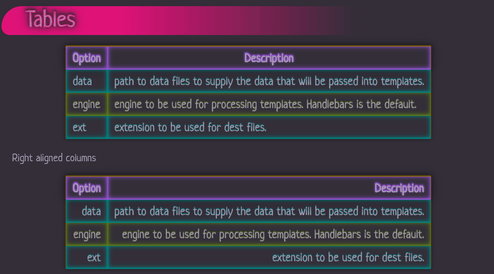
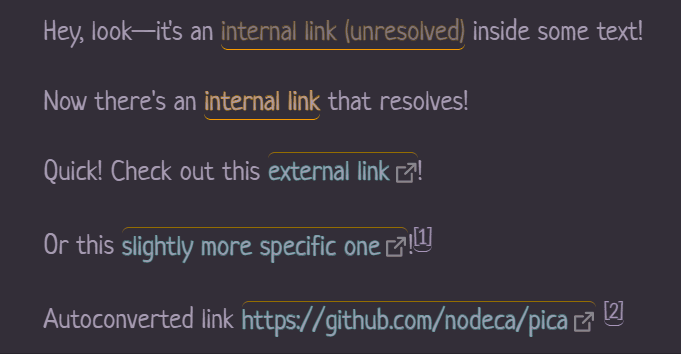

# Obsidian's Wyrd

And amazing. So I'm making this theme weird, too.

Wyrd is a purple-hued, low-contrast, dual-mode theme for [Obsidian.md](https://obsidian.md).

It's also not like most other themes.

## About Wyrd

> A quick note: Wyrd is still very much a work-in-progress, as visible with the [roadmap](#Roadmap) below. There are a number of sections that I haven't had a chance to change yet; the work so far represents the vast majority of what I use on a regular basis.

Wyrd is not minimal.

It's expressive, colorful, and animated.

I like to experiment with CSS to create something visually unique, so familiar styles have unusual touches...

... and unusual combinations of markdown can be used to create unique styles not otherwise available through markdown.

(What, you thought there was a _reason_ that was [censored](#Some-Notes) ? **Hah!**)

### Installing

For now, Wyrd is only available through this repository. To install in Obsidian, download `obsidian.css` and save it in your `.obsidian/themes` folder as `Wyrd.css`, then activate the theme within Obsidian's Theme Manager.

I've also submitted the theme to the Community Themes repo as well (hence the file's renaming); hopefully it'll be available directly in Obsidian soon! 💜

### Some Notes

It's worth pointing out that some styles present here can provide some measure of privacy for text while Previewing or in Publish.

Please don't mistake these for real privacy measures: they're anything but. CSS does not have the ability to provide real privacy measures for sensitive data.

These features are purely intended for fun, and are marked below under [Features](#Features).

## Features

- Visual balance between light and dark modes!
- Custom font selection `@import`ed through Google Fonts!
- All fonts scale with the current `--editor-font-size`!
  - Including headings (!!)
  - `--editor-font-size` is also manually set via CSS to ensure that the code continues to work as expected in [Obsidian Publish](https://obsidian.md/publish) environents.

### Wyrd's Custom Styles

Using specific combinations of markdown syntax, Wyrd converts them into additional styles beyond what's standard.

While many themes choose to use specific HTML tags that aren't commonly used anymore, I've opted for my own preference: Layering markdown syntax in specific ways.

#### Underline

Useage: `_*Underline*_`, `*_Underline_*`, `__**Underline**__`, or `**__Underline__**`

Yep, that's right—double up your preference of bold or italic to get yourself a nifty underline!

> Note: Due to how the parser works, you **must** alternate the symbols for bold or italic to prevent it from being styled as bold.

#### Blur

> Friendly Reminder: This is not a real privacy measure.

Useage: `~~==Blurred text==~~`

Blurs text in both Edit and Preview modes, and reveals it on hover with a drop shadow instead.

The Edit mode effect is much more subdued to provide a visual indication that doesn't render the text illegible.

#### Pseudo-Redaction

> Friendly Reminder: This is not a real privacy measure.

Useage: A bold-italic-bold-italic pattern around the text. Eg, `***___Redacted text___***` or `___***Redacted text***___`

In Preview mode, the text is rendered transparent with a near-black background, and makes it non-selectable. Selecting text around redactions will not select the redacted text itself, and the redacted text is excluded from being copied to the clipboard.

There is presently no unique style for this in Edit mode.

### Want to use the theme for Publish?

1. Copy the theme file to your vault's root and rename it `publish.css`.
2. Search for `/* Edit */` and delete everything below that line.
3. Copy any needed snippets into the file.
    - Be mindful of any rules that need to be at the top of the file! (This includes any `@import`s!)
    - The rest should be good to put at the bottom of the file.
4. Save the file.
5. Upload through Obsidian's `Publish changes` modal!

> Note: Eventually, I plan to have an additional `publish.css` file in this repository to cut out the second step for you.

## Roadmap

Right now, the roadmap doesn't reflect any particular priority of items. Please don't take their current placement as reflective of their importance.

### Note Content

- Text styling
  - Basic
    - [x] `**Bold**` styling
    - [x] `_Italic_` styling
    - [x] `~~Strikethrough~~` (ST) styling
    - [x] `==Highlight==` (HL) styling
  - Repeating
    - [x] `_*Italic + Italic*_` == underline
    - [x] `**__Bold + Bold__**` == underline
  - Expressive
    - [x] Bold & Italic
      - `**_Bold & Italic_**` or `__*Bold & Italic*__`
    - [x] Blur
      - `~~==Blur==~~`
      - Slight blur in edit mode
      - Heavier blur in preview mode
      - Hover exposes blurred text
    - [x] Pseudo-redaction
      - `***___Redacted text___***` or `___***Redacted text***___`
      - Text is transparent and non-selectable, with a suitable background for light and dark versions of the theme.
      - **NOTE: This does not provide security!**
        - "Redacted" text is _not_ removed from the DOM, which means it's still exposed to anyone smart enough use a browser's `Inspector`.
    - Bold + ...
      - [ ] `**==Bold + HL==**` == ?
      - [ ] `**~~Bold + ST~~**` == ?
    - Italic + ...
      - [ ] `_==Italic + HL==_` == ?
      - [ ] `_~~Italic + ST~~_` == ?
    - Highlight + ...
      - [ ] `==_HL + Italic_==` == ?
      - [ ] `==**HL + Bold**==` == ?
      - [ ] `==~~HL + ST~~==` == ?
    - Strikethrough + ...
      - [ ] `~~==ST + Italic==~~` == ?
      - [ ] `~~==ST + Bold==~~` == ?
- Lists
  - [x] Unordered
  - [x] Ordered
  - [ ] Task lists
    - [ ] Alternate styles for markers
- Link styling
  - [x] Internal link
  - [x] Unresolved internal link
  - [x] External link
  - [x] Footnotes
- Tables
  - [x] Alternating rows
  - [x] Row/cell highlighting on hover
- Code
  - [ ] Code blocks
  - [ ] Inline code
  - [ ] Syntax highlighting
- Embeds
  - [ ] Notes
  - [ ] Images
    - Cap size?
  - [ ] PDFs

### UI

- Sidebars
  - [ ] Leaf containers
- Titles
  - [ ] App title bar
  - [ ] Note title bars
- Panes
- Status bar
- Graph view
- Settings window
- `@media screen` queries (if needed)

### Plugin Support

#### Core Plugins

#### Community Plugins

- [ ] Style Settings
- ???

## Known Issues

- Typing while hovering over a list item in Edit Mode results in a constantly flickering transition
- Links in headings have no transition despite having one styled
