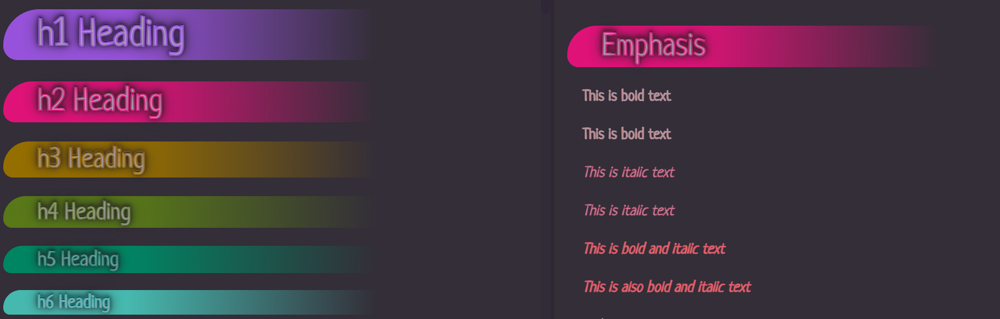

# Obsidian's Wyrd

And amazing. So I'm making this theme weird, too.

Wyrd is a purple-hued, low-contrast, dual-mode theme for [Obsidian.md](https://obsidian.md).

It's also not like most other themes.

## About Wyrd

I like to experiment with CSS to create something visually unique, so familiar styles have unusual touches...

... and unusual combinations of markdown can be used to create unique styles not otherwise available through markdown.

(What, you thought there was a _reason_ that was censored? **Hah!**)

## Features

- Visual balance between light and dark modes!
- Custom font selection `@import`ed through Google Fonts!
- All fonts scale with the current `--editor-font-size`!
  - Including headings (!!)
  - `--editor-font-size` is also manually set via CSS to ensure that the code continues to work as expected in [Obsidian Publish](https://obsidian.md/publish) environents.

### Planned Features

Note: This is currently a bit lagging behind my plans... I'll update this section once I have time!

- [ ] Snippet to make font selection locally available for offline use
  - Necessary, as some fonts from google contain 50+ variations, and would make the CSS file absurdly large
  - This would also save the performance hit of `@import`ing the fonts
- [ ] Style Settings compatability

## Roadmap

### Note Content

- Text styling
  - Basic
    - [x] `**Bold**` styling
    - [x] `_Italic_` styling
    - [x] `~~Strikethrough~~` (ST) styling
    - [x] `==Highlight==` (HL) styling
  - Repeating
    - [x] `_*Italic + Italic*_` == underline
    - [x] `*_Bold + Bold_*` == underline
    - [-] ~~`====HL + HL====` == ?~~ Does not render as dual highlights due to parsing
    - [-] ~~`~~~~ST + ST====` == ?~~ Renders as code block until second line of `~~~~` is reached by parser
  - Expressive
    - Bold + ...
      - [?] `**_Bold + Italic_**` == Bold & Italic (Keep? Distinguish?)
      - [ ] `**==Bold + HL==**` == ?
      - [ ] `**~~Bold + ST~~**` == ?
    - Italic + ...
      - [?] `_**Italic + Bold**_` == Bold & Italic (Keep? Distinguish?)
      - [ ] `_==Italic + HL==_` == ?
      - [ ] `_~~Italic + ST~~_` == ?
    - Highlight + ...
      - [ ] `==_HL + Italic_==` == ?
      - [ ] `==**HL + Bold**==` == ?
      - [ ] `==~~HL + ST~~==` == ?
    - Strikethrough + ...
      - [ ] `~~==ST + Italic==~~` == ?
      - [ ] `~~==ST + Bold==~~` == ?
      - [ ] `~~==ST + HL==~~` == blur text
- Lists
  - [x] Unordered
  - [x] Ordered
  - [ ] Task lists
    - [ ] Alternate styles for markers
- Link styling
  - [x] Internal link
  - [x] Unresolved internal link
  - [x] External link
  - [x] Footnotes
- Tables
  - [ ] Alternating rows
  - [ ] Row/cell highlighting on hover
- Code
  - [ ] Code blocks
  - [ ] Inline code
  - [ ] Syntax highlighting
- Embeds
  - [ ] Notes
  - [ ] Images
    - Cap size?
  - [ ] PDFs

### UI

- Sidebars
  - [ ] Leaf containers
- Titles
  - [ ] App title bar
  - [ ] Note title bars
- Panes
- Status bar
- Graph view
- Settings window
- `@media screen` queries

### Plugin Support

- [ ] Style Settings
- ???

## Known Issues

- [x] Links disappear in headings
  - [x] Heading links are not distinct
- [x] List spacing feels a bit _too_ tight in preview mode
